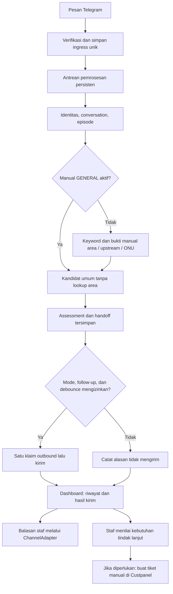

# PRD — Upaznet Helpdesk Automation
**Versi:** 2.1 · **Tanggal:** 20 September 2026 · **Status:** baseline prototype terpadu  
**Pemilik produk:** Akbar · **Persetujuan:** pengguna menyetujui rekomendasi yang dibahas, termasuk lifecycle episode, balasan staf dari dashboard, dan evaluasi otomatis saat inbound.

Dokumen ini adalah **satu acuan requirement aktif** untuk prototype, menggantikan PRD v1.2, mini PRD triage, dan catatan desain sebelumnya. [Design System](DESIGN_SYSTEM.md) mengatur presentasi UI; [decision log](decision-log.md) menyimpan histori. Dokumen lama telah dihapus dari repository oleh pengguna setelah konsolidasi; histori keputusan dipertahankan di decision log, bukan sebagai requirement paralel. Spesifikasi ini tidak menyatakan aplikasi, migration, atau integrasi sudah dibuat.

## 1. Tujuan dan batas keberhasilan
- Fokus produk disepakati: **Inbox Helpdesk + Auto-Triage + Konteks Jaringan**. Custpanel tetap sistem utama untuk tiket, delegasi teknisi, pelaporan tiket dan finance.
- Staf membuat tiket secara manual di Custpanel berdasarkan hasil pemeriksaan dashboard. Tidak ada pembuatan/sinkronisasi tiket otomatis dalam scope saat ini. Episode komplain mengelompokkan penanganan percakapan; bukan tiket teknisi kedua.
- Mempercepat respons pertama komplain ISP menggunakan template tetap dan rule deterministik, lalu menyerahkan penanganan kepada staf.
- Menggabungkan Mass Outage manual dan Complaint Auto-Triage otomatis dalam satu antrean dan satu jalur outbound.
- Mengurangi pengulangan kerja: satu episode untuk masalah pelanggan yang sama, banyak episode dapat terkait satu kejadian jaringan.
- Konteks dari PRD lama: ±6.000 pelanggan, 1–100 chat/hari, tim kecil termasuk shift malam. Burst saat gangguan perlu diuji; angka harian bukan ukuran peak load.
- Prototype memvalidasi rule, lifecycle, audit, pengiriman Telegram, dan workflow staf menggunakan data dummy. **Tidak membuktikan akurasi OLT/NMS nyata.**
- Keberhasilan demo: komplain tester muncul di dashboard; assessment dan template dapat dijelaskan; maksimal satu respons otomatis yang layak; staf dapat membalas dari dashboard; kegagalan terlihat dan pekerjaan tidak hilang.

## 2. Scope dan stack
| Dibangun sekarang | Ditunda |
|---|---|
| Next.js App Router + TypeScript, Vercel untuk prototype | Deployment produksi dan kapasitas/SLA produksi |
| Supabase PostgreSQL + Auth saja | Redis, microservices, Supabase Realtime/Storage/Edge Functions |
| Telegram Bot API melalui ChannelAdapter | Integrasi WhatsApp Cloud API dan verifikasi aturan produksinya |
| Login staf, inbox/antrean percakapan, riwayat, input balasan, catatan internal | Sistem tiket pengganti Custpanel, finance, delegasi teknisi, SLA engine |
| Mock customer identity/topology/ONU/upstream provider | Akses OLT/NMS/Custpanel nyata; kontrak vendor belum tersedia |
| Evaluasi otomatis pada inbound + incident manual override | Monitoring kontinu, broadcast proaktif, auto-ticketing Custpanel |
| Keyword, template management, shadow/rollout, audit | LLM, diagnosis akar penyebab, reboot/perubahan perangkat |
| Skenario uji dummy yang dapat diulang | Upload attachment staf, desain dark mode lengkap |

**Larangan:** tidak membaca untuk integrasi, menyentuh, mengimpor, atau bergantung pada proyek terpisah **Upaznet Config & Command Generator**. Tidak ada dependency lintas proyek tersebut.

## 3. Konsep dan persona
| Konsep | Definisi |
|---|---|
| Customer/service | Pelanggan dan layanan yang dilaporkan; prototype fixture satu layanan/customer, multi-layanan produksi OPEN |
| Channel identity | Akun bot + identitas pengirim yang dapat ditautkan ke customer terverifikasi |
| Conversation | Pengelompokan pesan berdasarkan inactivity 24 jam; bukan episode masalah dan tidak mereset debounce |
| Complaint episode | Pengelompokan masalah dalam percakapan; dapat melintasi conversation; bukan tiket teknisi Custpanel |
| Network event | Bukti kejadian gangguan otomatis/dummy dengan ID stabil; dapat memengaruhi banyak episode |
| Manual incident | Override staf GENERAL/AREA_SPECIFIC; lifecycle dan guard satu ACTIVE dipertahankan |
| Assessment | Snapshot alasan keputusan pada satu pesan, termasuk bukti, waktu, rule, dan template |
| Reply attempt | Status usaha pengiriman; klaim pekerjaan tidak sama dengan balasan berhasil |

**Pelanggan tester:** komplain melalui private chat bot Telegram, menerima respons simulasi dan balasan staf.  
**Helpdesk/NOC:** akses setara, memakai dashboard untuk menilai antrean, membalas, memperbarui status, dan mengelola incident. Tidak perlu aktivasi manual setiap gangguan otomatis.

## 4. Alur terpadu

- Semua pesan valid terlihat di inbox; komplain koneksi dibuat/ditautkan ke episode. Pesan lainnya masuk review, tidak diam-diam dibuang.
- Pesan duplikat tidak membuat episode/assessment/kiriman baru; pekerjaan lama yang belum selesai dapat dilanjutkan.
- GENERAL adalah pengecualian keyword dan lookup: semua inbound pelanggan eligible untuk pemberitahuan umum, tetap dibatasi mode/follow-up/debounce.
- Selain GENERAL, pesan lainnya/ambigu tidak mendapat auto-reply dan dapat dikoreksi staf.
- Pengiriman ke pelanggan hanya setelah antrean tersimpan; teks tidak boleh mengklaim handoff sebelum penyimpanan berhasil. Inbound non-komplain yang mendapat GENERAL tetap memakai episode penerimaan berkategori lainnya untuk claim dan handoff; tidak diberi label komplain koneksi secara palsu.

## 5. Identifikasi, keyword, dan data
**FR-01 Identitas:** matching pengirim ke mapping dummy yang dibuat staf; ID yang diketik hanya calon identitas, bukan bukti kepemilikan. Konflik/lebih dari satu layanan → unverified/manual. Jangan mengungkap status akun hanya karena seseorang mengetahui ID-nya.
**FR-02 Scope fixture:** private chat tester allowlist; grup/non-tester tidak menerima automation. Unresolved sender tetap memiliki internal identity ID agar dapat diantrekan dan didedup.
**FR-03 Klasifikasi:** normalisasi huruf/spasi dan exact keyword/phrase dengan batas kata; daftar awal “wifi mati”, “internet mati”, “internet lemot”, “tidak bisa internet”, “LOS”. “Error” tanpa konteks → review. Simpan versi rule, kata yang cocok, label staf, dan koreksi.
**FR-04 Follow-up:** episode NEW/IN_PROGRESS yang sama tidak membuat balasan otomatis baru. Setelah staf mulai menangani/membalas, automation first response dihentikan pada episode tersebut, sekalipun klaim otomatis belum pernah dipakai. Peralihan ke mode kirim tidak mengambil alih percakapan staf.
**FR-05 Data:** bedakan no_match, unverified, unknown, stale, timeout, dan provider_error. Status unknown bukan online. Online bukan bukti kualitas internet/Wi-Fi normal.
**FR-06 Cache:** mapping area pelanggan TTL 24 jam dari baseline; status ONU/upstream maksimal 5 menit. Untuk klaim area/upstream, mapping dampak juga harus valid dan berversi. Jangan menggunakan TTL mapping sebagai TTL kesehatan jaringan.

## 6. Lifecycle
### 6.1 Episode komplain
| Aksi | Transisi | Aturan |
|---|---|---|
| Komplain baru | → NEW | Gabungkan ke episode layanan sama yang belum final; konflik ditinjau staf |
| Mulai tangani | NEW → IN_PROGRESS | Catat aktor/waktu; hentikan first response yang belum dikirim |
| Nyatakan pulih | NEW/IN_PROGRESS → RESOLVED | Manual dengan catatan; ONU online saja tidak menyelesaikan kasus |
| Masih bermasalah | RESOLVED → IN_PROGRESS | Reopen episode sama, debounce tidak reset |
| Arsipkan | RESOLVED → CLOSED | Manual, final; tidak ada auto-close inactivity |
| Masalah baru sesudah CLOSED | → episode baru | Tautkan riwayat; staf boleh pisahkan masalah berbeda sebelum kasus lama final |

- “Terima kasih” saja tidak reopen. Sinyal keyword keluhan yang sama pada RESOLVED dapat reopen; pesan ambigu tetap review tanpa balasan otomatis.
- Satu episode per masalah, bukan satu per hari. Pergantian conversation 24 jam tidak membuat masalah baru.
- Minimal satu episode utama terbuka per layanan untuk penggabungan otomatis; split oleh staf membuat relasi eksplisit. Hindari penggabungan lintas layanan.
- Komplain yang terkait network event tetap ditangani per pelanggan; event pulih tidak otomatis menutup seluruh episode.

### 6.2 Incident manual
- GENERAL / AREA_SPECIFIC; create langsung ACTIVE, tanpa DRAFT.
- ACTIVE → RESOLVED; RESOLVED → ACTIVE (reopen, ID sama); RESOLVED → CLOSED manual; ACTIVE → CLOSED hanya force-close dengan alasan trimmed non-empty.
- Maksimal satu **manual incident ACTIVE**, ditegakkan partial unique index. Batas ini tidak membatasi jumlah complaints/network events otomatis.
- Reopen tidak reset debounce. CLOSED final. Resolve/close tidak mengirim notifikasi otomatis ke semua pelanggan.
- Field editable saat ACTIVE: description, estimated_recovery (text bebas), odp_ids, odc_ids dan template. Semua perubahan diaudit; tidak memicu re-broadcast.
- AREA_SPECIFIC exact match ODP atau ODC melalui mapping valid; minimal satu affected ID. GENERAL tidak lookup area. Shift malam tetap memberi notifikasi internal secara manual.
- State update dan activity log atomik; gunakan expected version/state agar dua staf tidak saling menimpa.
- Setelah resolve committed, tidak boleh ada send baru yang diotorisasi atas incident tersebut. Request yang sudah diterima provider tidak dapat ditarik; catat waktu dispatch dan versi incident untuk audit.

## 7. Prioritas keputusan dan template
Evaluasi top-down. Tidak menjalankan pengirim Mass Outage dan triage secara independen.
| Prioritas | Syarat | Kandidat | Handoff |
|---|---|---|---|
| 1 | Manual GENERAL ACTIVE | MASS_GENERAL, tanpa lookup atau syarat identitas pelanggan terverifikasi | Inbox/episode + incident |
| 2 | Komplain koneksi, manual AREA_SPECIFIC ACTIVE, identitas valid dan area match | MASS_AREA | Episode + incident |
| 3 | Komplain koneksi, upstream down fresh dan dampak ke layanan valid | NETWORK_DISRUPTION, walau ONU online/unknown | Episode + event/bukti |
| 4 | Komplain koneksi, pelanggan LOS fresh, threshold area valid | LOS_AREA | Episode + snapshot/event |
| 5 | Komplain koneksi, pelanggan LOS fresh tanpa bukti area memadai | LOS_INDIVIDUAL | Episode + status |
| 6 | Komplain koneksi, pelanggan online fresh, tidak ada bukti relevan di atas | ONLINE_CHECK | Episode pemeriksaan lanjut |
| 7 | Komplain koneksi dengan identitas/data gagal/basi/unknown | GENERIC | Episode + reason |
| 8 | Lainnya/ambigu tanpa GENERAL | Tidak mengirim | Review staf |

- AREA_SPECIFIC no-match/gagal tidak memberi hak mengirim MASS_AREA; triage boleh lanjut dengan bukti independen atau GENERIC. Ini perubahan eksplisit dari perilaku fail-silent lama.
- Tanpa identitas valid, hanya pemberitahuan GENERAL yang tidak spesifik pelanggan atau GENERIC yang diizinkan.
- Upstream provider gagal tidak membatalkan bukti ONU valid; ONU stale tidak membatalkan bukti upstream + mapping dampak yang valid. Validitas dinilai per klaim.
- ONU online dengan area LOS tetapi tidak ada bukti upstream pelanggan terdampak → ONLINE_CHECK, bukan klaim pelanggan LOS.
- Sistem tidak menyebut kabel/FS/ODP/ODC “putus” atau “sedang diperbaiki” tanpa bukti terkonfirmasi. Arti FS dan observabilitas sumber internet tetap OPEN.
- Pertimbangkan semua bukti sebelum mengambil satu klaim pengiriman; perubahan bukti sesudah respons pertama hanya memperbarui ringkasan staf.

| Key | Teks dasar |
|---|---|
| MASS_GENERAL | “Saat ini terdapat gangguan jaringan yang berdampak luas. Laporan Anda sudah masuk antrean helpdesk. Estimasi pemulihan: {{estimated_recovery}}.” |
| MASS_AREA | “Saat ini terdapat gangguan jaringan di area layanan Anda. Laporan Anda sudah masuk antrean helpdesk. Estimasi pemulihan: {{estimated_recovery}}.” |
| NETWORK_DISRUPTION | “Terdeteksi indikasi gangguan jaringan yang memengaruhi layanan Anda. Laporan Anda sudah masuk antrean helpdesk.” |
| LOS_AREA | “Terdeteksi indikasi gangguan sinyal yang juga terlihat pada beberapa koneksi di area Anda. Laporan Anda sudah masuk antrean helpdesk.” |
| LOS_INDIVIDUAL | “Terdeteksi indikasi gangguan sinyal pada koneksi Anda. Laporan Anda sudah masuk antrean helpdesk untuk diperiksa.” |
| ONLINE_CHECK | “Perangkat koneksi Anda terdeteksi online saat pengecekan. Keluhan Anda tetap kami teruskan ke helpdesk untuk pemeriksaan lebih lanjut.” |
| GENERIC | “Mohon maaf atas kendalanya. Kondisi koneksi Anda belum dapat kami pastikan. Laporan Anda sudah masuk antrean helpdesk untuk pemeriksaan manual.” |

**FR-07 Template:** template incident mengalahkan default untuk key yang sama; tepat satu versi aktif per scope/key. Key/placeholder tidak valid atau template kosong → jangan dispatch, catat template_error untuk staf. Estimasi kosong dirender “masih dalam pemeriksaan”. Simpan versi dan snapshot teks aktual; edit tidak mengubah riwayat. Tidak ada konten generatif.
**FR-08 Simulasi:** semua outbound prototype, termasuk staf, diberi prefix [SIMULASI DATA DUMMY]; hanya ke tester allowlist. Catatan internal tidak boleh ikut terkirim.

## 8. Rollout dan debounce
| Mode | Perilaku |
|---|---|
| SHADOW (default) | Assessment dan antrean berjalan; tidak ada outbound otomatis; tidak mengambil klaim debounce |
| LOS_AND_GENERIC | Manual outage/upstream/LOS boleh mengirim; fallback GENERIC aktif; kandidat ONLINE_CHECK dirender GENERIC |
| FULL | Tambahkan ONLINE_CHECK; semua aturan identitas dan bukti tetap berlaku |
| Emergency stop | Menghentikan dispatch otomatis; antrean tetap berjalan, balasan manual staf tetap tersedia |

- Mode rollout bukan toggle aktivasi tiap gangguan. Evaluasi otomatis dilakukan **saat inbound**, bukan monitoring kontinu/broadcast proaktif.
- Perubahan mode diaudit dan berlaku untuk pesan baru; backlog shadow tidak diputar ulang. Simpan mode/version saat penerimaan dan periksa kembali mode yang lebih membatasi sebelum send.
- Maksimal satu respons otomatis per customer/sender + episode. Reopen, perubahan template, pergantian shift/mode/channel, dan penautan identitas tidak meresetnya.
- Untuk incident/event yang diketahui, tambahkan klaim unik customer/sender + incident/event ID agar membuat episode baru tidak membalas outage sama lagi.
- Episode dan incident/event claim harus didapatkan atomik; konflik salah satu → skip seluruh send, bukan meninggalkan klaim parsial.
- GENERAL menggunakan internal sender identity bila customer belum ditemukan. Penautan kemudian merekonsiliasi claim secara atomik tanpa memberi jatah baru.
- Sukses GENERIC menghabiskan jatah episode. Jika event baru diketahui kemudian, tautkan bukti/claim event tanpa mengirim respons kedua.
- Unique constraint mengamankan klaim concurrency, **tidak menjamin exactly-once pada provider eksternal**. Hasil send ambigu ditangani pada §11.

## 9. Provider dan fixture tanpa OLT/NMS
Fondasi implementasi, schema tambahan, endpoint staf dan cara uji tersedia di [NETWORK_PROVIDER.md](NETWORK_PROVIDER.md). Skenario dipilih per pemeriksaan; tidak mengubah mode global. Pembacaan tidak menyegarkan waktu observasi. Refresh fixture adalah aksi SQL lokal eksplisit, bukan bagian seed ulang.
**FR-09 Kontrak domain:** input verified service/customer ID, waktu evaluasi, deadline, freshness. Output outcome ok/not_found/error; status LOS/online/unknown; source; observed_at; checked_at; mapping ODP/ODC dan versinya; safe error code.
- Snapshot area: anggota unik, status/waktu tiap anggota, total anggota scope, coverage. Simpan aggregate dan versi threshold pada assessment.
- Snapshot upstream terpisah: link/scope ID, up/down/unknown, source, observed_at, evidence/event ID, affected service IDs. Jangan menyimpulkan upstream dari status ONU.
- Fresh ≤5 menit; missing/future timestamp tidak valid. Prototype timeout 2 detik per pemeriksaan; tidak retry provider pada jalur ACK. Angka timeout adalah default implementasi prototype, bukan SLA vendor.
- Ambang dummy disetujui: ≥3 LOS, rasio LOS ≥50% dari anggota dengan status fresh yang diketahui, coverage anggota tersebut ≥80% dari total scope. Unknown/stale tidak masuk denominator valid; anggota dihitung sekali. ODP atau ODC dapat memenuhi; gunakan scope paling spesifik yang memenuhi.
- MockProvider membaca database dummy di belakang NetworkStatusProvider. Domain tidak mengimpor provider/vendor/channel.
- Event fixture ID tetap sama selama kejadian yang sama, termasuk pembacaan ulang; fixture pemulihan + kejadian baru menghasilkan ID baru. Observasi stale tidak berarti pulih. Korelasi event otomatis produksi/hysteresis belum ditentukan.
- Pemilihan skenario hanya mengubah data simulasi, bukan mengaktifkan manual incident atau mengirim broadcast.

| Fixture wajib | Contoh terkontrol |
|---|---|
| Normal | Layanan online, upstream up |
| LOS individu | 1 dari 10 anggota LOS, semua data fresh |
| LOS area | 4 dari 8 valid LOS, total anggota 10 → lolos |
| Kurang coverage | 4 dari 6 valid LOS, total 10 → area unknown |
| Upstream gagal | Upstream down + layanan mapped, ONU tetap online |
| Gagal monitoring | Provider timeout/error; tidak mengklaim jaringan down |
| Basi/identitas | Observasi >5 menit, unknown, sender unverified, ID konflik |
| Dua sumber | Manual incident + bukti otomatis; hanya satu respons |
| Pemulihan/reopen | ID event stabil, episode reopen, debounce tidak reset |

Seed idempotent wajib memakai ID deterministik dan namespace data simulasi; jangan menghapus log uji sebelumnya untuk mengganti skenario. Kontrol fixture hanya ada pada environment prototype.

## 10. Model data dan invariant
Model ini spesifikasi target, bukan daftar seluruh fitur yang sudah diimplementasikan. supabase/migrations/ adalah source of truth schema aktual; database_schema.sql lama adalah snapshot arsip. Enam tabel foundation dan empat tabel mock telah memiliki migration; entitas target lain menyusul.
| Entitas | Relasi/field penting |
|---|---|
| customers, services, channel_identities | Customer ↔ layanan; identity unik channel/account/sender; link nullable dan verification status |
| odcs, odps, service_topology | Relasi dummy, versi mapping; tidak mengarang format Custpanel nyata |
| conversations, messages | Channel/account/message ID, received/provider time, direction, actor, conversation dan episode link |
| complaints | Service/identity, status, first/last message, resolution note, version, previous episode |
| incidents, incident_activity_log | Lifecycle manual, affected areas, actor/time/reason dan snapshot perubahan |
| mock_network_scenarios, mock_onu_status, mock_upstream_status, mock_upstream_impacts | Skenario terisolasi, status/waktu, event ID stabil, dampak layanan eksplisit dengan versi topology |
| network_events, complaint_event_links | Event stabil; hubungan banyak complaints dengan event; bukan incident ACTIVE global |
| triage_assessments | Message, episode, incident/event, bukti/freshness, rule/mode/template version, decision/reason, staff correction |
| response_templates, template_versions | Satu versi aktif per scope/key, rendered snapshot pada outbound |
| reply_claims, outbound_attempts | Episode/event scopes unik, claim/sent/failed/unknown, manual/auto actor, provider ID nullable |
| ingress_events, processing_jobs | Dedup key, processing state, attempt, lease, next_attempt_at dan last error |
| automation_settings, audit_log | Mode/version, aksi staf, correlation ID, before/after |

**FR-10 Invariant:** transaksi aplikasi mengikat ingress+job, episode association, claim, dan audit terkait. Foreign key, uniqueness, basic CHECK di DB; business rule tetap TypeScript. Version check untuk aksi staf. Actor diambil dari session server, bukan input bebas.
**FR-11 Waktu:** semua timestamp disimpan UTC, dashboard WIB/Asia-Jakarta; received_at berbeda dari observed_at, checked_at, sent_at. Default now bukan mekanisme updated_at; aplikasi wajib memperbaruinya.
**FR-12 Scope ID:** dedup Telegram mencakup channel + bot account + chat_id + message_id. Message ID asli saja tidak unik lintas chat. Normalisasi ada di adapter.
**FR-13 Riwayat:** pesan outbound menyimpan teks aktual, origin otomatis/staf, dan status. FK template yang dapat berubah tidak cukup untuk audit.

## 11. Runtime, keamanan, dan ketahanan
**Boundary:** HTTP adapter → application services/orchestration → pure domain → repository/provider ports. Unit test domain tanpa DB. Jangan menaruh rule dalam route handler atau trigger.

**FR-14 Webhook:** verifikasi secret Telegram sebelum efek samping; simpan ingress+job atomik lalu ACK. DB gagal → non-success agar provider dapat mencoba ulang. Duplicate diterima idempotent. API aplikasi: success/data/error; sukses memakai data, gagal error code/message. Handshake WhatsApp yang mensyaratkan challenge mentah dikecualikan hanya pada endpoint protokol tersebut saat fase produksi.
**FR-15 Processing:** Postgres menjadi penyimpanan job; job di-claim atomik dengan lease/attempt. Pemrosesan setelah ACK melalui task Vercel yang ditunggu runtime, bukan fire-and-forget tanpa pencatatan. Crash sebelum dispatch → pekerjaan aman dilanjutkan.
**Default recovery prototype:** inbound baru memicu drain terbatas; dashboard aktif melakukan polling read setiap 5 detik dan permintaan recovery terautentikasi setiap 30 detik; tombol “Proses ulang pekerjaan tertunda” tersedia. Claim lease mencegah dua pemicu mengerjakan job sama. Tidak menggantungkan ACK pada dashboard.
**Batas:** tanpa dashboard/inbound baru, job gagal dapat menunggu pemicu recovery. Scheduler produksi harus dipilih sebelum layanan tanpa pengawasan; bukan bagian klaim SLA prototype. waitUntil/after tetap terikat durasi function, bukan durable queue.
**FR-16 Outbound:** simpan attempt sebelum HTTP send. Sukses berarti provider menerima dan mengembalikan ID, bukan pelanggan membaca. Timeout setelah dispatch → unknown, tampilkan untuk staf; jangan otomatis retry. Respons penolakan pasti/retryable dapat dijadwalkan dengan backoff, maksimal 3 total attempt, patuhi Retry-After. Permanen → failed. Crash pada state sending dianggap unknown sampai direkonsiliasi.
**FR-17 Manual reply:** staf menulis bebas melalui dashboard, bukan generasi LLM. Send menggunakan client request ID unik agar klik ganda tidak menggandakan pesan. Balasan manual dicatat dan menghentikan automation pending untuk episode; jika request otomatis sudah in-flight, UI menampilkan kondisi tersebut.
**FR-18 Auth:** akun staf dikendalikan/invite-only; hak semua staf setara. Read sesuai kebutuhan, mutasi melalui backend tervalidasi. Revisi D41: authenticated tidak berarti bebas write/delete seluruh tabel; audit/claim tidak dapat diubah dari browser. Secrets/service-role hanya server-side, tidak NEXT_PUBLIC.
**FR-19 Privasi:** ke pelanggan hanya teks yang layak untuk identitasnya; ODP/ODC internal, pelanggan tetangga/count, stack trace dan credential hanya untuk staf bila diperlukan, tidak masuk template. Whitelist placeholder, escape konten pada UI, verifikasi webhook, pembatasan ukuran/rate request, session/CSRF untuk aksi staf.
**Retensi prototype:** message/complaint/assessment 90 hari setelah episode final (inbound non-episode 90 hari dari penerimaan), audit incident 1 tahun, technical log 30 hari. Pembersihan tidak boleh menghapus claim episode/incident/event yang masih dapat dipakai sehingga debounce aktif tidak reset. Ini default teknis; kebijakan privasi resmi produksi tetap OPEN.

## 12. Dashboard dan design system
Acuan detail: [DESIGN_SYSTEM.md](DESIGN_SYSTEM.md). Bahasa Indonesia, desktop-first, nyaman pada layar laptop; responsive untuk review mobile.
| Halaman | Fungsi inti |
|---|---|
| Inbox/Antrean (landing) | Percakapan masuk dan episode komplain, unread/NEW/ditangani, filter, detail chat, balasan dan konteks pemeriksaan |
| Gangguan | Tab otomatis/bukti dan incident manual, riwayat, affected area, lifecycle |
| Pelanggan (pendukung) | Direktori/pencarian seluruh pelanggan untuk identitas dan jalur layanan; bukan landing, bukan CRM/administrasi pelanggan kedua |
| Template | Key/scope/version, preview dummy, validasi placeholder dan simpan versi |
| Log & kesehatan | Keputusan beserta alasannya, failure/unknown/pending jobs, aktivitas staf |
| Pengaturan & simulasi | SHADOW/rollout/emergency stop, allowlist, fixture; bukan panel konfigurasi perangkat |

Hasil pemeriksaan menjadi acuan staf mengisi tiket di Custpanel secara manual. Usulan ringkasan yang dapat disalin dan referensi nomor tiket adalah peningkatan berikutnya; belum diimplementasikan pada fondasi provider. Tidak membangun landing marketing, grafik dekoratif, atau peta topologi kompleks untuk prototype. Simulator dan log teknis terpisah dari alur balas sehari-hari.

## 13. Acceptance dan metrik
| ID | Skenario | Lulus jika |
|---|---|---|
| AC-01 | Normal/LOS individu/LOS area/upstream down | Key dan snapshot sesuai tabel, tidak mengarang penyebab |
| AC-02 | Boundary 3 LOS/50%/80%, freshness 5 menit | Tepat batas valid; melewati usia/kurang coverage → unknown |
| AC-03 | Lookup gagal/unverified/ID pelanggan lain | GENERIC atau GENERAL non-spesifik; tidak bocor status akun |
| AC-04 | Duplikat/paralel/dua chat punya message ID sama | Tiap pesan sah tercatat; tidak ada balasan atau episode duplikat |
| AC-05 | Reopen, event sama, generik lalu LOS | Tidak ada respons otomatis kedua; staf melihat bukti terbaru |
| AC-06 | Mode dan emergency stop berubah saat pending | Tidak replay shadow; keputusan dibatasi mode terbaru |
| AC-07 | Dua staf resolve/edit + incident dan auto bersamaan | Version conflict jelas; audit atomik; hanya satu klaim send |
| AC-08 | Crash sebelum send / setelah provider menerima | Aman resume sebelum dispatch; hasil ambigu terlihat tanpa retry buta |
| AC-09 | Balasan staf, catatan internal, klik ganda | Satu pesan ke Telegram; catatan internal tidak terkirim |
| AC-10 | GENERAL, AREA no-match, lainnya | GENERAL tanpa lookup; lainnya non-general hanya review; fallback sesuai §7 |
| AC-11 | Retention/template edit/identity linking | Riwayat teks tetap, debounce aktif tetap, tidak memberi jatah baru |
| AC-12 | Keyboard/mobile/error/loading | Alur utama dapat dioperasikan; tidak kehilangan draft ketika error |

**Target prototype, bukan hasil terukur:** ACK p95 ≤2 detik; first response p95 ≤10 detik pada operasi normal; burst fixture 20 inbound simultan. Job recovery dilaporkan terpisah. Target klasifikasi precision/recall masing-masing ≥90% pada ≥100 pesan berlabel dengan kelas terwakili, koreksi template ≤5%; 0 duplicate reply/kebocoran pada acceptance suite.
Ukur coverage, no-match, stale, lookup error, debounce skips, manual takeover, provider accepted/failed/unknown, latency dan umur pending job. Shadow mengukur klasifikasi/keputusan, bukan latency kirim.
Rollout tester: seluruh acceptance keselamatan lulus → Akbar memilih tahap kirim awal → nilai koreksi → FULL. Tidak mengirim ke pelanggan nyata tanpa tahap kesiapan produksi.

## 14. Urutan pembangunan dan definition of done
| Tahap | Deliverable | Bukti selesai |
|---|---|---|
| P0 Foundation | Next.js/TypeScript, konfigurasi lokal, Supabase Auth, migration awal, tokens UI | Login staf, env tervalidasi, seed dummy idempotent |
| P1 Domain & data | Lifecycle, keyword, provider mock, rule/claim contracts | Unit test dan integration constraint/concurrency lulus |
| P2 Vertical slice shadow | Telegram webhook → ingress/job → episode/assessment → antrean | Satu komplain dummy terlihat end-to-end, tanpa outbound |
| P3 Balas dan penanganan | LOS_AND_GENERIC, input staf, delivery state, recovery | Balasan sampai tester, klik ganda/crash diuji |
| P4 Outage & controls | Override manual, event correlation, template version, logs/simulator | Prioritas/satu ACTIVE/reopen/debounce lintas sumber lulus |
| P5 Pilot lengkap | FULL, dataset label, UX/accessibility, uji burst | Acceptance suite dan metrik dilaporkan, demo Akbar |

Rincian kesiapan implementasi ada di [README](../README.md#status-implementasi-lokal). Persiapan bertahap P0/P2: akses Supabase project prototype, bot token/secret dan tester IDs, Vercel project/env. Tidak memerlukan OLT/NMS. Credential diberikan melalui environment, tidak dimasukkan ke PRD/log/repo. Tidak ada commit/push/deploy yang diklaim telah dilakukan dalam pekerjaan spesifikasi ini.

### Status implementasi P1 (21 September 2026)

- Fondasi provider jaringan dan P1.1 identitas/klasifikasi selesai dalam scope masing-masing; lihat [review P1.1](P1_1_REVIEW.md).
- P1.1 mengembalikan hasil analisis berversi, belum menyimpan assessment/label koreksi atau membuat identity sender baru. Penyimpanan ingress/inbox mengikuti P2.
- P1.2 decision engine kandidat selesai: [review P1.2](P1_2_REVIEW.md). Kandidat dipisahkan dari penerapan mode; dispatchAuthorized=false sampai seluruh guard runtime terpenuhi. Rendering/pengelolaan template dan outbound belum dibuat.
- P1.3 lifecycle dan P1.4 kontrak/transaksi/claim beserta concurrency tests masih belum selesai. P1 belum ditutup.

## 15. Pertanyaan terbuka dan migrasi produksi
**Tidak memblokir prototype:** definisi FS, vendor/payload OLT/NMS, Custpanel lookup nyata, multi-service, real ODP/ODC IDs, failover upstream, kebijakan recovery event/hysteresis, real rate limits.
**Sebelum produksi:** validasi kepemilikan identitas, freshness/threshold nyata, penyedia job scheduler tanpa dashboard, backup/restore dan retention resmi, izin/channel WhatsApp Cloud API termasuk window/template/webhook, pengujian beban dan data nyata.
Adapter membantu portabilitas, tetapi tidak menjamin migrasi WhatsApp tanpa perubahan schema/operasional sama sekali. Format/status vendor diterjemahkan pada provider; domain menerima kontrak yang sama.
**Default desain baru pada konsolidasi:** recovery prototype berbasis pemicu, retry limit, aturan retensi episode, warna/layout UI. Ini pilihan implementasi yang eksplisit dan dapat ditinjau, bukan fakta tentang jaringan ISP.

## 16. Rekonsiliasi keputusan
| Histori | Baseline aktif |
|---|---|
| D2 manual activation | Tetap untuk manual incident; triage otomatis inbound tidak memerlukannya |
| D7/D15 gagal/no-match → diam | Tidak boleh klaim affected; komplain dapat menerima GENERIC |
| D17 tanpa interpretasi pesan | GENERAL tetap override; triage memakai keyword, tanpa LLM |
| D27 tidak membangun topologi | Dummy topologi untuk pengujian; mapping vendor nyata tetap OPEN |
| D30/D31 tanpa queue/reply UI | Digantikan antrean dashboard dan input balasan staf |
| D39 constraint debounce/dedup | Dipertahankan, diperjelas scope Telegram, episode+event dan status attempt |
| D41 authenticated full write | Digantikan akses staf setara dengan mutasi backend dan audit terlindungi |
| D35/D36 reopen/close | Dipertahankan pada incident manual; episode memakai lifecycle terpisah |
| D52/D57 rollout/isolasi | SHADOW → LOS_AND_GENERIC → FULL; satu jalur keputusan gabungan |
| D63/D64 rekomendasi | Disetujui pengguna pada konsolidasi D65 |

Keputusan scope terbaru D71 menegaskan Custpanel tetap menangani tiket/teknisi/finance; dashboard ini fokus percakapan dan pemeriksaan. D72 merinci default implementasi provider mock.

## 17. Referensi teknis
- [Telegram Bot API](https://core.telegram.org/bots/api): message ID scoped per chat, secret webhook, dan sendMessage.
- [Vercel function API](https://vercel.com/docs/functions/functions-api-reference/vercel-functions-package): background task tetap tunduk pada timeout function.
- [WCAG 2.2](https://www.w3.org/TR/WCAG22/): acuan accessibility design system; bukan klaim audit produk sudah lulus.

